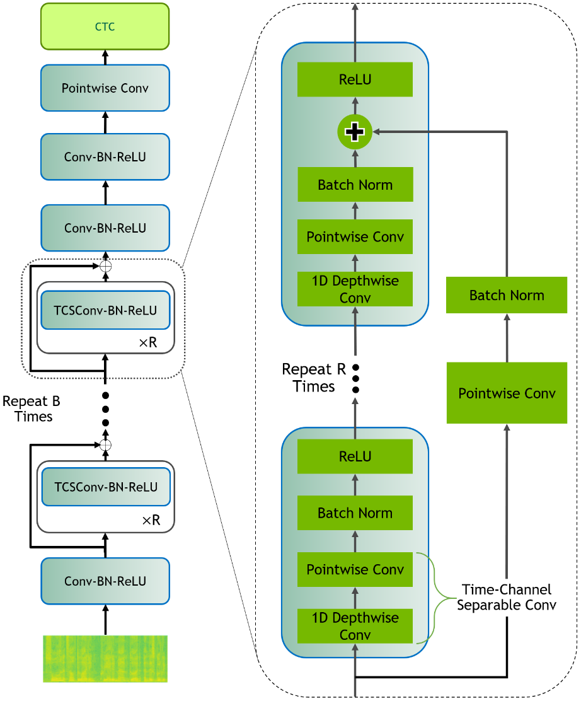

# Scribosermo

_Train fast Speech-to-Text networks in different languages._

<div align="center">
    
    
</div>

<br/>

[](https://gitlab.com/Jaco-Assistant/Scribosermo/-/commits/master)
[](https://gitlab.com/Jaco-Assistant/Scribosermo/-/commits/master)
[](https://github.com/psf/black)
[](https://github.com/prettier/prettier)
[](https://gitlab.com/Jaco-Assistant/Scribosermo/-/commits/master)

<br/>

## Usage

Note: This repository is focused on training STT-networks.
You can find a short and experimental inference example [here](extras/exporting/testing_tflite.py),
but please try to solve any problems that occur while using the models outside of this repository yourself.

Requirements are:

- Computer with a modern gpu and working nvidia+docker setup
- Basic knowledge in python and deep-learning
- A lot of training data in your required language \
  (preferable >100h for fine-tuning and >1000h for new languages)

#### General infos

File structure will look as follows:

```text
my_speech2text_folder
    checkpoints
    corcua                 <- Library for datasets
    data_original
    data_prepared
    Scribosermo            <- This repository
```

Clone [corcua](https://gitlab.com/Jaco-Assistant/corcua):

```bash
git clone https://gitlab.com/Jaco-Assistant/corcua.git
```

Build and run docker container:

```bash
docker build -f Scribosermo/Containerfile -t scribosermo ./Scribosermo/

./Scribosermo/run_container.sh
```

<br/>

#### Download and prepare voice data

Follow [readme](preprocessing/README.md) in `preprocessing` directory for preparing the voice data.

#### Create the language model

Follow [readme](langmodel/README.md) in `langmodel` directory for generating the language model.

#### Training

Follow [readme](training/README.md) in `training` directory for training your network. \
For easier inference follow the exporting [readme](extras/exporting/README.md) in `extras/exporting` directory.

<br/>

## Datasets and Networks

You can find more details about the currently used datasets [here](preprocessing/README.md#Datasets).

|                  |      |     |     |      |     |     |       |
| ---------------- | ---- | --- | --- | ---- | --- | --- | ----- |
| Language         | DE   | EN  | ES  | FR   | IT  | PL  | Noise |
| Duration (hours) | 2370 | 982 | 817 | 1028 | 360 | 169 | 152   |
| Datasets         | 37   | 1   | 8   | 7    | 5   | 3   | 3     |

<br>

Implemented networks:
[DeepSpeech1](https://arxiv.org/pdf/1412.5567.pdf),
[DeepSpeech2](https://arxiv.org/pdf/1512.02595.pdf),
[QuartzNet](https://arxiv.org/pdf/1910.10261.pdf),
[Jasper](https://arxiv.org/pdf/1904.03288.pdf),
[ContextNet](https://arxiv.org/pdf/2005.03191.pdf)(simplified),
[Conformer](https://arxiv.org/pdf/2005.08100.pdf)(simplified),
[CitriNet](https://arxiv.org/pdf/2104.01721.pdf)

Notes on the networks:

- Not every network is fully tested, but each could be trained with one single audio file.
- Some networks might differ slightly from their paper implementations.

Supported networks with their trainable parameter count (using English alphabet):

|         |             |             |                                                                                                                                         |        |                  |                 |                                                                                                                                                                                        |
| ------- | ----------- | ----------- | --------------------------------------------------------------------------------------------------------------------------------------- | ------ | ---------------- | --------------- | -------------------------------------------------------------------------------------------------------------------------------------------------------------------------------------- |
| Network | DeepSpeech1 | DeepSpeech2 | QuartzNet&nbsp;&nbsp;&nbsp;&nbsp;&nbsp;&nbsp;&nbsp;&nbsp;&nbsp;&nbsp;&nbsp;&nbsp;&nbsp;&nbsp;&nbsp;&nbsp;&nbsp;&nbsp;&nbsp;&nbsp;&nbsp; | Jasper | ContextNetSimple | SimpleConformer | CitriNet&nbsp;&nbsp;&nbsp;&nbsp;&nbsp;&nbsp;&nbsp;&nbsp;&nbsp;&nbsp;&nbsp;&nbsp;&nbsp;&nbsp;&nbsp;&nbsp;&nbsp;&nbsp;&nbsp;&nbsp;&nbsp;&nbsp;&nbsp;&nbsp;&nbsp;&nbsp;&nbsp;&nbsp;&nbsp; |
| Config  |             |             | 5x5&nbsp;&nbsp; / 15x5&nbsp;&nbsp; / +LSTM                                                                                              |        | 0.8              | 16x240x4        | 256&nbsp;&nbsp;&nbsp;&nbsp; / 344&nbsp;&nbsp;&nbsp;&nbsp; / +LSTM                                                                                                                      |
| Params  | 48.7M       | 120M        | 6.7M / 18.9M / 21.5M                                                                                                                    | 323M   | 21.6M            | 21.7M           | 10.9M / 19.3M / 21.6M                                                                                                                                                                  |

<br>

## Pretrained Checkpoints and Language Models

By default, the checkpoints are provided under the same licence as this repository, but a lot of
datasets have extra conditions (for example non-commercial use only) which also have to be applied.
The QuartzNet models are double licenced withs Nvidia's NGC, because they use their pretrained weights.
Please check this yourself for the models you want to use.

**Mozilla's DeepSpeech**:

You can find the old models later on this page, in the `old experiments` [section](#old-experiments). \
Below models are not compatible to the DeepSpeech client anymore!

**German**:

- Quartznet15x5, CV only (WER: 7.5%): [Link](https://www.mediafire.com/folder/rrse5ydtgdpvs/cv-wer0077)
- Quartznet15x5, D37CV (WER: 6.6%): [Link](https://www.mediafire.com/folder/jh5unptizgzou/d37cv-wer0066)
- Scorer: [TCV](https://www.mediafire.com/file/xb2dq2roh8ckawf/kenlm_de_tcv.scorer/file),
  [D37CV](https://www.mediafire.com/file/pzj8prgv2h0c8ue/kenlm_de_all.scorer/file),
  [PocoLg](https://www.mediafire.com/file/b64k0uqv69ehe9p/de_pocolm_large.scorer/file)

**English**:

- Quartznet5x5 (WER: 4.5%): [Link](https://www.mediafire.com/folder/3c0a353nlppkv/qnet5)
- Quartznet15x5 (WER: 3.7%): [Link](https://www.mediafire.com/folder/eb340s2ab4sv0/qnet15)
- Scorer: [Link](https://github.com/mozilla/DeepSpeech/releases/tag/v0.9.3) (to DeepSpeech)

**Spanish**:

- Quartznet15x5, CV only (WER: 10.5%): [Link](https://www.mediafire.com/folder/1peahr4b17t8i/cv-wer0105)
- Quartznet15x5, D8CV (WER: 10.0%): [Link](https://www.mediafire.com/folder/2x2kdq3wlbg0h/d8cv-wer0100)
- Scorer: [KenSm](https://www.mediafire.com/file/h38hmax7wnkxqfd/kenlm_es_n12.scorer/file),
  [PocoLg](https://www.mediafire.com/file/pwt95u2wik8gr5s/es_pocolm_d8cv.scorer/file)

**French**:

- Quartznet15x5, CV only (WER: 12.1%): [Link](https://www.mediafire.com/folder/bee6yoirkcoui/cv-wer0121)
- Quartznet15x5, D7CV (WER: 11.0%): [Link](https://www.mediafire.com/folder/hesl65v0369b4/d7cv-wer0110)
- Scorer: [KenSm](https://www.mediafire.com/file/pcj322gp5ddpfhd/kenlm_fr_n12.scorer/file),
  [PocoLg](https://www.mediafire.com/file/55qv3bpu6z0m1p9/fr_pocolm_d7cv.scorer/file)

**Italian**:

- Quartznet15x5, D5CV (WER: 11.5%): [Link](https://www.mediafire.com/folder/atxlkc8xxzosq/d5cv-wer0115)
- Scorer: [PocoLg](https://www.mediafire.com/file/cuf9adxqqxbqlbu/it_pocolm_d5cv.scorer/file)

<br/>

## Contribution

You can contribute to this project in multiple ways:

- Help to solve the open issues
- Implement new networks or augmentation options
- Train new models or improve the existing \
  (Requires a gpu and a lot of time, or multiple gpus and some time)
- Experiment with the language models
- Add a new language:

  - Extend `data/` directory with the `alphabet` and `langdicts` files
  - Add speech datasets
  - Find text corpora for the language model

#### Tests

See [readme](tests/README.md) in `tests` directory for testing instructions.

<br/>

## Results

| Language | Network       | Additional Infos                                                                                                | Performance&nbsp;Results                                                                                       |
| -------- | ------------- | --------------------------------------------------------------------------------------------------------------- | -------------------------------------------------------------------------------------------------------------- |
| EN       | Quartznet5x5  | Results from Nvidia-Nemo, using LS-dev-clean as test dataset                                                    | WER greedy: 0.0537                                                                                             |
| EN       | Quartznet5x5  | Converted model from Nvidia-Nemo, using LS-dev-clean as test dataset                                            | Loss: 9.7666 <br> CER greedy: 0.0268 <br> CER with lm: 0.0202 <br> WER greedy: 0.0809 <br> WER with lm: 0.0506 |
| EN       | Quartznet5x5  | Pretrained model from Nvidia-Nemo, one extra epoch on LibriSpeech to reduce the different spectrogram problem   | Loss: 7.3253 <br> CER greedy: 0.0202 <br> CER with lm: 0.0163 <br> WER greedy: 0.0654 <br> WER with lm: 0.0446 |
| EN       | Quartznet5x5  | above, using LS-dev-clean as test dataset (for better comparison with results from Nemo)                        | Loss: 6.9973 <br> CER greedy: 0.0203 <br> CER with lm: 0.0159 <br> WER greedy: 0.0648 <br> WER with lm: 0.0419 |
|          |               |                                                                                                                 |                                                                                                                |
| EN       | Quartznet15x5 | Results from Nvidia-Nemo, using LS-dev-clean as test dataset                                                    | WER greedy: 0.0379                                                                                             |
| EN       | Quartznet15x5 | Converted model from Nvidia-Nemo, using LS-dev-clean as test dataset                                            | Loss: 5.8044 <br> CER greedy: 0.0160 <br> CER with lm: 0.0130 <br> WER greedy: 0.0515 <br> WER with lm: 0.0355 |
| EN       | Quartznet15x5 | Pretrained model from Nvidia-Nemo, four extra epochs on LibriSpeech to reduce the different spectrogram problem | Loss: 5.3074 <br> CER greedy: 0.0141 <br> CER with lm: 0.0128 <br> WER greedy: 0.0456 <br> WER with lm: 0.0374 |
| EN       | Quartznet15x5 | above, using LS-dev-clean as test dataset (for better comparison with results from Nemo)                        | Loss: 5.1035 <br> CER greedy: 0.0132 <br> CER with lm: 0.0108 <br> WER greedy: 0.0435 <br> WER with lm: 0.0308 |

Next trainings were all done with above pretrained _Quartznet15x5_ network.

| Language | Datasets          | Additional Infos                                                                                                | Performance&nbsp;Results                                                                                                                     |
| -------- | ----------------- | --------------------------------------------------------------------------------------------------------------- | -------------------------------------------------------------------------------------------------------------------------------------------- |
| DE       | Tuda              | Learning rate 0.0001; Training time on 2x1080Ti was about 16h                                                   | Loss: 61.3615 <br> CER greedy: 0.1481 <br> CER with lm: 0.0914 <br> WER greedy: 0.5502 <br> WER with lm: 0.2381                              |
| DE       | Tuda              | Learning rate 0.001                                                                                             | Loss: 59.3143 <br> CER greedy: 0.1329 <br> CER with lm: 0.0917 <br> WER greedy: 0.4956 <br> WER with lm: 0.2448                              |
| DE       | CommonVoice       | Training time on 2x1080Ti was about 70h; Reusing scorer from DeepSpeech-Polyglot trainings                      | Loss: 11.6188 <br> CER greedy: 0.0528 <br> CER with lm: 0.0319 <br> WER greedy: 0.1853 <br> WER with lm: 0.0774                              |
| DE       | CommonVoice       | Above network; tested on Tuda dataset                                                                           | Loss: 25.5442 <br> CER greedy: 0.0473 <br> CER with lm: 0.0340 <br> WER greedy: 0.1865 <br> WER with lm: 0.1199                              |
| DE       | MLS               | Learning rate 0.0001; Test on CommonVoice                                                                       | Loss: 38.5387 <br> CER greedy: 0.1967 <br> CER with lm: 0.1616 <br> WER greedy: 0.5894 <br> WER with lm: 0.2584                              |
| DE       | MLS + CommonVoice | Above network, continuing training with CommonVoice; Learning rate 0.001; Test on CommonVoice                   | Loss: 12.3243 <br> CER greedy: 0.0574 <br> CER with lm: 0.0314 <br> WER greedy: 0.2122 <br> WER with lm: 0.0788                              |
| DE       | D37               | Continued training from CV-checkpoint with 0.077 WER; Learning rate 0.001; Test on CommonVoice                  | Loss: 10.4031 <br> CER greedy: 0.0491 <br> CER with lm: 0.0369 <br> WER greedy: 0.1710 <br> WER with lm: 0.0824                              |
| DE       | D37               | Above network; Test on Tuda                                                                                     | Loss: 16.6407 <br> CER greedy: 0.0355 <br> CER with lm: 0.0309 <br> WER greedy: 0.1530 <br> WER with lm: 0.1113                              |
| DE       | D37 + CommonVoice | Fine-tuned above network on CommonVoice again; Learning rate 0.001; Test on CommonVoice                         | Loss: 9.9733 <br> CER greedy: 0.0456 <br> CER with lm: 0.0323 <br> WER greedy: 0.1601 <br> WER with lm: 0.0760                               |
| DE       | D37 + CommonVoice | Above network; Scorer build with all new training transcriptions; Beam size 1024; Test on CommonVoice           | CER with lm: 0.0279 <br> WER with lm: 0.0718                                                                                                 |
| DE       | D37 + CommonVoice | Like above; Test on Tuda                                                                                        | Loss: 17.3551 <br> CER greedy: 0.0346 <br> CER with lm: 0.0262 <br> WER greedy: 0.1432 <br> WER with lm: 0.1070                              |
|          |                   |                                                                                                                 |                                                                                                                                              |
| ES       | CommonVoice       | Frozen with 4 epochs, then full training                                                                        | Eval-Loss: 29.0722 <br> Test-Loss: 31.2095 <br> CER greedy: 0.1568 <br> CER with lm: 0.1461 <br> WER greedy: 0.5289 <br> WER with lm: 0.3446 |
| ES       | CommonVoice       | Additional Dropout layers after each block and end convolutions; Continuing above frozen checkpoint             | Eval-Loss: 30.5518 <br> Test-Loss: 32.7240 <br> CER greedy: 0.1643 <br> CER with lm: 0.1519 <br> WER greedy: 0.5523 <br> WER with lm: 0.3538 |
| FR       | CommonVoice       | Frozen with 4 epochs, then full training                                                                        | Eval-Loss: 26.9454 <br> Test-Loss: 30.6238 <br> CER greedy: 0.1585 <br> CER with lm: 0.1821 <br> WER greedy: 0.4570 <br> WER with lm: 0.4220 |
|          |                   |                                                                                                                 |                                                                                                                                              |
| ES       | CommonVoice       | Updated augmentations; Continuing above frozen checkpoint                                                       | Eval-Loss: 28.0187                                                                                                                           |
| ES       | CommonVoice       | Like above, but lower augmentation strength                                                                     | Eval-Loss: 26.5313                                                                                                                           |
| ES       | CommonVoice       | Like above, but higher augmentation strength                                                                    | Eval-Loss: 34.6475                                                                                                                           |
| ES       | CommonVoice       | Only spectrogram cut/mask augmentations                                                                         | Eval-Loss: 27.2635                                                                                                                           |
| ES       | CommonVoice       | Random speed and pitch augmentation, only spectrogram cutout                                                    | Eval-Loss: 25.9359                                                                                                                           |
|          |                   |                                                                                                                 |                                                                                                                                              |
| ES       | CommonVoice       | Improved transfer-learning with alphabet extension                                                              | Eval-Loss: 13.0415 <br> Test-Loss: 14.8321 <br> CER greedy: 0.0742 <br> CER with lm: 0.0579 <br> WER greedy: 0.2568 <br> WER with lm: 0.1410 |
| ES       | CommonVoice       | Like above, with esrp-delta=0.1 and lr=0.002; Training for 29 epochs                                            | Eval-Loss: 10.3032 <br> Test-Loss: 12.1623 <br> CER greedy: 0.0533 <br> CER with lm: 0.0460 <br> WER greedy: 0.1713 <br> WER with lm: 0.1149 |
| ES       | CommonVoice       | Above model; Extended scorer with Europarl+News dataset                                                         | CER with lm: 0.0439 <br> WER with lm: 0.1074                                                                                                 |
| ES       | CommonVoice       | Like above; Beam size 1024 instead of 256                                                                       | CER with lm: 0.0422 <br> WER with lm: 0.1053                                                                                                 |
| ES       | D8                | Continued training from above CV-checkpoint; Learning rate reduced to 0.0002; Test on CommonVoice               | Eval-Loss: 9.3886 <br> Test-Loss: 11.1205 <br> CER greedy: 0.0529 <br> CER with lm: 0.0456 <br> WER greedy: 0.1690 <br> WER with lm: 0.1075  |
| ES       | D8 + CommonVoice  | Fine-tuned above network on CommonVoice again; Learning rate 0.0002; Test on CommonVoice                        | Eval-Loss: 9.6201 <br> Test-Loss: 11.3245 <br> CER greedy: 0.0507 <br> CER with lm: 0.0421 <br> WER greedy: 0.1632 <br> WER with lm: 0.1025  |
| ES       | D8 + CommonVoice  | Like above; Beam size 1024 instead of 256                                                                       | CER with lm: 0.0404 <br> WER with lm: 0.1003                                                                                                 |
|          |                   |                                                                                                                 |                                                                                                                                              |
| FR       | CommonVoice       | Similar to Spanish CV training above; Training for 26 epochs                                                    | Eval-Loss: 10.4081 <br> Test-Loss: 13.6226 <br> CER greedy: 0.0642 <br> CER with lm: 0.0544 <br> WER greedy: 0.1907 <br> WER with lm: 0.1248 |
| FR       | CommonVoice       | Like above; Beam size 1024 instead of 256                                                                       | CER with lm: 0.0511 <br> WER with lm: 0.1209                                                                                                 |
| FR       | D7                | Continued training from above CV-checkpoint                                                                     | Eval-Loss: 9.8695 <br> Test-Loss: 12.7798 <br> CER greedy: 0.0604 <br> CER with lm: 0.0528 <br> WER greedy: 0.1790 <br> WER with lm: 0.1208  |
| FR       | D7 + CommonVoice  | Fine-tuned above network on CommonVoice again                                                                   | Eval-Loss: 9.8874 <br> Test-Loss: 12.9053 <br> CER greedy: 0.0613 <br> CER with lm: 0.0536 <br> WER greedy: 0.1811 <br> WER with lm: 0.1208  |
| FR       | D7 + CommonVoice  | Like above; Beam size 1024 instead of 256                                                                       | CER with lm: 0.0501 <br> WER with lm: 0.1167                                                                                                 |
|          |                   |                                                                                                                 |                                                                                                                                              |
| DE       | CommonVoice       | Updated augmentations/pipeline to above Spanish training; Reduced esrp-delta 1.1 -> 0.1 compared to last DE run | Eval-Loss: 10.3421 <br> Test-Loss: 11.4755 <br> CER greedy: 0.0512 <br> CER with lm: 0.0330 <br> WER greedy: 0.1749 <br> WER with lm: 0.0790 |
| DE       | D37               | Continued training from above CV-checkpoint; Learning rate reduced by factor 10; Test on CommonVoice            | Eval-Loss: 9.6293 <br> Test-Loss: 10.7855 <br> CER greedy: 0.0503 <br> CER with lm: 0.0347 <br> WER greedy: 0.1705 <br> WER with lm: 0.0793  |
| DE       | D37 + CommonVoice | Fine-tuned above network on CommonVoice again; Test on CommonVoice                                              | Eval-Loss: 9.3287 <br> Test-Loss: 10.4325 <br> CER greedy: 0.0468 <br> CER with lm: 0.0309 <br> WER greedy: 0.1599 <br> WER with lm: 0.0741  |

Running some experiments with different language models:

| Language | Datasets          | Additional Infos                                                                                                    | Performance&nbsp;Results                                                                                             |
| -------- | ----------------- | ------------------------------------------------------------------------------------------------------------------- | -------------------------------------------------------------------------------------------------------------------- |
| DE       | D37 + CommonVoice | Use PocoLM instead of KenLM (similar LM size); Checkpoint from D37+CV training with WER=0.0718; Test on CommonVoice | CER with lm: 0.0285 <br> WER with lm: 0.0701                                                                         |
| DE       | D37 + CommonVoice | Like above; Test on Tuda                                                                                            | CER with lm: 0.0265 <br> WER with lm: 0.1037                                                                         |
| DE       | D37 + CommonVoice | Use unpruned language model (1.5GB instead of 250MB); Rest similar to above; Test on CommonVoice                    | CER with lm: 0.0276 <br> WER with lm: 0.0673                                                                         |
| DE       | D37 + CommonVoice | Like above; Test on Tuda                                                                                            | CER with lm: 0.0261 <br> WER with lm: 0.1026                                                                         |
| DE       | D37 + CommonVoice | Use pruned language model with similar size to English model (850MB); Rest similar to above; Test on CommonVoice    | CER with lm: 0.0277 <br> WER with lm: 0.0672                                                                         |
| DE       | D37 + CommonVoice | Like above; Test on Tuda                                                                                            | CER with lm: 0.0260 <br> WER with lm: 0.1024                                                                         |
| DE       | D37 + CommonVoice | Checkpoint from D37+CV training with WER=0.0741; with large (850MB) scorer; Test on CommonVoice                     | CER with lm: 0.0299 <br> WER with lm: 0.0712                                                                         |
| DE       | D37 + CommonVoice | Like above; Test on Tuda; Small and full scorers were behind above model with both testsets, too                    | CER with lm: 0.0280 <br> WER with lm: 0.1066                                                                         |
| DE       | CommonVoice       | Test above checkpoint from CV training with WER=0.0774 with PocoLM large                                            | Test-Loss: 11.6184 <br> CER greedy: 0.0528 <br> CER with lm: 0.0312 <br> WER greedy: 0.1853 <br> WER with lm: 0.0748 |
|          |                   |                                                                                                                     |                                                                                                                      |
| ES       | D8 + CommonVoice  | Use PocoLM instead of KenLM (similar LM size); Checkpoint from D8+CV training with WER=0.1003; Test on CommonVoice  | CER with lm: 0.0407 <br> WER with lm: 0.1011                                                                         |
| ES       | D8 + CommonVoice  | Like above; Large scorer (790MB)                                                                                    | CER with lm: 0.0402 <br> WER with lm: 0.1002                                                                         |
| ES       | D8 + CommonVoice  | Like above; Full scorer (1.2GB)                                                                                     | CER with lm: 0.0403 <br> WER with lm: 0.1000                                                                         |

Experimenting with new architectures on LibriSpeech dataset:

| Network                    | Additional Infos                                                                                 | Performance&nbsp;Results                                                                                                                                                                                |
| -------------------------- | ------------------------------------------------------------------------------------------------ | ------------------------------------------------------------------------------------------------------------------------------------------------------------------------------------------------------- |
| ContextNetSimple (0.8)     | Run with multiple full restarts, ~3:30h/epoch; increased LR from 0.001 to 0.01 since iteration 5 | Eval-Loss-1: 64.2793 <br> Eval-Loss-2: 24.5743 <br> Eval-Loss-3: 19.4896 <br> Eval-Loss-4: 18.4973 <br> Eval-Loss-4: 18.4973 <br> Eval-Loss-5: 9.3007 <br> Eval-Loss-6: 8.1340 <br> Eval-Loss-7: 7.5170 |
| SimpleConformer (16x240x4) | Completed training after 28 epochs (~3:20h/epoch), without any augmentations                     | Eval-Loss: 70.6178                                                                                                                                                                                      |
| Citrinet (344)             | Completed training after 6 epochs (~4h/epoch), didn't learn anything                             | Eval-Loss: 289.7605                                                                                                                                                                                     |
| QuartzNet (15x5)           | Continued old checkpoint                                                                         | Eval-Loss: 5.0922 <br> Test-Loss: 5.3353 <br> CER greedy: 0.0139 <br> CER with lm: 0.0124 <br> WER greedy: 0.0457 <br> WER with lm: 0.0368                                                              |
| QuartzNet (15x5+LSTM)      | Frozen+Full training onto old checkpoint                                                         | Eval-Loss: 4.9105 <br> Test-Loss: 5.3112 <br> CER greedy: 0.0143 <br> CER with lm: 0.0125 <br> WER greedy: 0.0477 <br> WER with lm: 0.0370                                                              |

Tests with reduced dataset size and with multiple restarts:

| Language | Datasets          | Additional Infos                                                                                                                                                                       | Performance&nbsp;Results                                                                                                                                                 |
| -------- | ----------------- | -------------------------------------------------------------------------------------------------------------------------------------------------------------------------------------- | ------------------------------------------------------------------------------------------------------------------------------------------------------------------------ |
| DE       | CV short (314h)   | Test with PocoLM large; about 18h on 2xNvidia-V100; Iteration 1                                                                                                                        | Eval-Loss: 12.5308 <br> Test-Loss: 13.9343 <br> CER greedy: 0.0654 <br> CER with lm: 0.0347 <br> WER greedy: 0.2391 <br> WER with lm: 0.0834                             |
| DE       | CV short (314h)   | Iteration 2; about 22h                                                                                                                                                                 | Eval-Loss: 11.3072 <br> Test-Loss: 12.6970 <br> CER greedy: 0.0556 <br> CER with lm: 0.0315 <br> WER greedy: 0.1986 <br> WER with lm:0.0776                              |
| DE       | CV short (314h)   | Iteration 3; about 13h                                                                                                                                                                 | Eval-Loss: 11.2485 <br> Test-Loss: 12.5631 <br> CER greedy: 0.0532 <br> CER with lm: 0.0309 <br> WER greedy: 0.1885 <br> WER with lm: 0.0766                             |
| DE       | CV short (314h)   | Test Iteration 3 on Tuda                                                                                                                                                               | Test-Loss: 27.5804 <br> CER greedy: 0.0478 <br> CER with lm: 0.0326 <br> WER greedy: 0.1913 <br> WER with lm: 0.1166                                                     |
| DE       | D37 + CommonVoice | Additional training iteration on CV using checkpoint from D37+CV training with WER=0.0718                                                                                              | Eval-Loss: 8.7156 <br> Test-Loss: 9.8192 <br> CER greedy: 0.0443 <br> CER with lm: 0.0268 <br> WER greedy: 0.1544 <br> WER with lm:0.0664                                |
| DE       | D37 + CommonVoice | Above, test on Tuda                                                                                                                                                                    | Test-Loss: 19.2681 <br> CER greedy: 0.0358 <br> CER with lm: 0.0270 <br> WER greedy: 0.1454 <br> WER with lm:0.1023                                                      |
|          |                   |                                                                                                                                                                                        |                                                                                                                                                                          |
| ES       | CV short (203h)   | A fifth iteration with lr=0.01 did not converge; about 19h on 2xNvidia-V100 for first iteration                                                                                        | Eval-Loss-1: 10.8212 <br> Eval-Loss-2: 10.7791 <br> Eval-Loss-3: 10.7649 <br> Eval-Loss-4: 10.7918                                                                       |
| ES       | CV short (203h)   | Above, test of first iteration                                                                                                                                                         | Test-Loss: 12.5954 <br> CER greedy: 0.0591 <br> CER with lm: 0.0443 <br> WER greedy: 0.1959 <br> WER with lm: 0.1105                                                     |
| ES       | CV short (203h)   | Above, test of third iteration                                                                                                                                                         | Test-Loss: 12.6006 <br> CER greedy: 0.0572 <br> CER with lm: 0.0436 <br> WER greedy: 0.1884 <br> WER with lm: 0.1093                                                     |
| ES       | D8 + CommonVoice  | Additional training iterations on CV using checkpoint from D8+CV training with WER=0.1003; test of first iteration with PocoLM large; a second iteration with lr=0.01 did not converge | Eval-Loss-1: 9.5202 <br> Eval-Loss-2: 9.6056 <br> Test-Loss: 11.2326 <br> CER greedy: 0.0501 <br> CER with lm: 0.0398 <br> WER greedy: 0.1606 <br> WER with lm:0.0995    |
| ES       | CV short (203h)   | Two step frozen training, about 13h+18h                                                                                                                                                | Eval-Loss-1: 61.5673 <br> Eval-Loss-2: 10.9956 <br> Test-Loss: 12.7028 <br> CER greedy: 0.0604 <br> CER with lm: 0.0451 <br> WER greedy: 0.2015 <br> WER with lm: 0.1111 |
| ES       | CV short (203h)   | Single step with last layer reinitialization, about 18h                                                                                                                                | Eval-Loss: 11.6488 <br> Test-Loss: 13.4355 <br> CER greedy: 0.0643 <br> CER with lm: 0.0478 <br> WER greedy: 0.2163 <br> WER with lm: 0.1166                             |
|          |                   |                                                                                                                                                                                        |                                                                                                                                                                          |
| FR       | CV short (364h)   | The fourth iteration with lr=0.01; about 25h on 2xNvidia-V100 for first iteration; test of third iteration                                                                             | Eval-Loss-1: 12.6529 <br> Eval-Loss-2: 11.7833 <br> Eval-Loss-3: 11.7141 <br> Eval-Loss-4: 12.6193                                                                       |
| FR       | CV short (364h)   | Above, test of third iteration                                                                                                                                                         | Test-Loss: 14.8373 <br> CER greedy: 0.0711 <br> CER with lm: 0.0530 <br> WER greedy: 0.2142 <br> WER with lm: 0.1248                                                     |
| FR       | D7 + CommonVoice  | Additional training iterations on CV using checkpoint from D7+CV training with WER=0.1167; test of first iteration with PocoLM large; a second iteration with lr=0.01 did not converge | Eval-Loss-1: 9.5452 <br> Eval-Loss-2: 9.5860 <br> Test-Loss: 12.5477 <br> CER greedy: 0.0590 <br> CER with lm: 0.0466 <br> WER greedy: 0.1747 <br> WER with lm:0.1104    |
|          |                   |                                                                                                                                                                                        |                                                                                                                                                                          |
| IT       | CommonVoice       | Transfer from English                                                                                                                                                                  | Eval-Loss: 12.7120 <br> Test-Loss: 14.4017 <br> CER greedy: 0.0710 <br> CER with lm: 0.0465 <br> WER greedy: 0.2766 <br> WER with lm: 0.1378                             |
| IT       | CommonVoice       | Transfer from Spanish with alphabet shrinking                                                                                                                                          | Eval-Loss: 10.7151 <br> Test-Loss: 12.3298 <br> CER greedy: 0.0585 <br> CER with lm: 0.0408 <br> WER greedy: 0.2208 <br> WER with lm: 0.1216                             |
| IT       | D5 + CommonVoice  | Continuing above from Spanish                                                                                                                                                          | Eval-Loss: 9.3055 <br> Test-Loss: 10.8521 <br> CER greedy: 0.0543 <br> CER with lm: 0.0403 <br> WER greedy: 0.2000 <br> WER with lm: 0.1170                              |
| IT       | D5 + CommonVoice  | Fine-tuned above checkpoint on CommonVoice again (lr=0.0001)                                                                                                                           | Eval-Loss: 9.3318 <br> Test-Loss: 10.8453 <br> CER greedy: 0.0533 <br> CER with lm: 0.0395 <br> WER greedy: 0.1967 <br> WER with lm: 0.1153                              |

<br/>

## Old experiments

The following experiments were run with an old version of this repository, at that time named as _DeepSpeech-Polyglot_,
using the DeepSpeech1 network from [Mozilla-DeepSpeech](https://github.com/mozilla/DeepSpeech). \
While they are outdated, some of them might still provide helpful information for training the new networks.

Old checkpoints and scorers:

- German (D17S5 training and some older checkpoints, WER: 0.128, Train: ~1582h, Test: ~41h):
  [Link](https://drive.google.com/drive/folders/1oO-N-VH_0P89fcRKWEUlVDm-_z18Kbkb?usp=sharing)
- Spanish (CCLMTV training, WER: 0.165, Train: ~660h, Test: ~25h):
  [Link](https://drive.google.com/drive/folders/1-3UgQBtzEf8QcH2qc8TJHkUqCBp5BBmO?usp=sharing)
- French (CCLMTV training, WER: 0.195, Train: ~787h, Test: ~25h):
  [Link](https://drive.google.com/drive/folders/1Nk_1uFVwM7lj2RQf4PaQOgdAdqhiKWyV?usp=sharing)
- Italian (CLMV training, WER: 0.248 Train: ~257h, Test: ~21h):
  [Link](https://drive.google.com/drive/folders/1BudQv6nUvRSas69SpD9zHN-TmjGyedaK?usp=sharing)
- Polish (CLM training, WER: 0.034, Train: ~157h, Test: ~6h):
  [Link](https://drive.google.com/drive/folders/1_hia1rRmmsLRrFIHANH4254KKZhY3p1c?usp=sharing)

<br>

First experiments: \
(Default dropout is 0.4, learning rate 0.0005):

| Dataset                                       | Additional Infos                                                                                                                                                                          | Performance&nbsp;Results                               |
| --------------------------------------------- | ----------------------------------------------------------------------------------------------------------------------------------------------------------------------------------------- | ------------------------------------------------------ |
| Voxforge                                      |                                                                                                                                                                                           | WER: 0.676611 <br> CER: 0.403916 <br> loss: 82.185226  |
| Voxforge                                      | with augmentation                                                                                                                                                                         | WER: 0.624573 <br> CER: 0.348618 <br> loss: 74.403786  |
| Voxforge                                      | without "äöü"                                                                                                                                                                             | WER: 0.646702 <br> CER: 0.364471 <br> loss: 82.567413  |
| Voxforge                                      | cleaned data, without "äöü"                                                                                                                                                               | WER: 0.634828 <br> CER: 0.353037 <br> loss: 81.905258  |
| Voxforge                                      | above checkpoint, tested on not cleaned data                                                                                                                                              | WER: 0.634556 <br> CER: 0.352879 <br> loss: 81.849220  |
| Voxforge                                      | checkpoint from english deepspeech, without "äöü"                                                                                                                                         | WER: 0.394064 <br> CER: 0.190184 <br> loss: 49.066357  |
| Voxforge                                      | checkpoint from english deepspeech, with augmentation, without "äöü", dropout 0.25, learning rate 0.0001                                                                                  | WER: 0.338685 <br> CER: 0.150972 <br> loss: 42.031754  |
| Voxforge                                      | reduce learning rate on plateau, with noise and standard augmentation, checkpoint from english deepspeech, cleaned data, without "äöü", dropout 0.25, learning rate 0.0001, batch size 48 | WER: 0.320507 <br> CER: 0.131948 <br> loss: 39.923031  |
| Voxforge                                      | above with learning rate 0.00001                                                                                                                                                          | WER: 0.350903 <br> CER: 0.147837 <br> loss: 43.451263  |
| Voxforge                                      | above with learning rate 0.001                                                                                                                                                            | WER: 0.518670 <br> CER: 0.252510 <br> loss: 62.927200  |
| Tuda + Voxforge                               | without "äöü", checkpoint from english deepspeech, cleaned train and dev data                                                                                                             | WER: 0.740130 <br> CER: 0.462036 <br> loss: 156.115921 |
| Tuda + Voxforge                               | first Tuda then Voxforge, without "äöü", cleaned train and dev data, dropout 0.25, learning rate 0.0001                                                                                   | WER: 0.653841 <br> CER: 0.384577 <br> loss: 159.509476 |
| Tuda + Voxforge + SWC + Mailabs + CommonVoice | checkpoint from english deepspeech, with augmentation, without "äöü", cleaned data, dropout 0.25, learning rate 0.0001                                                                    | WER: 0.306061 <br> CER: 0.151266 <br> loss: 33.218510  |

<br/>

Some results with some older code version: \
(Default values: batch size 12, dropout 0.25, learning rate 0.0001, without "äöü", cleaned data , checkpoint from english deepspeech, early stopping, reduce learning rate on plateau, evaluation with scorer and top-500k words)

| Dataset                                       | Additional Infos                                                                                                                 | Losses                                     | Training epochs of best model | Performance&nbsp;Results         |
| --------------------------------------------- | -------------------------------------------------------------------------------------------------------------------------------- | ------------------------------------------ | ----------------------------- | -------------------------------- |
| Tuda + Voxforge + SWC + Mailabs + CommonVoice | test only with Tuda + CommonVoice others completely for training, language model with training transcriptions, with augmentation | Test: 29.363405 <br> Validation: 23.509546 | 55                            | WER: 0.190189 <br> CER: 0.091737 |
| Tuda + Voxforge + SWC + Mailabs + CommonVoice | above checkpoint tested with 3-gram language model                                                                               | Test: 29.363405                            |                               | WER: 0.199709 <br> CER: 0.095318 |
| Tuda + Voxforge + SWC + Mailabs + CommonVoice | above checkpoint tested on Tuda only                                                                                             | Test: 87.074394                            |                               | WER: 0.378379 <br> CER: 0.167380 |

<br/>

Some results with some older code version: \
(Default values: batch size 36, dropout 0.25, learning rate 0.0001, without "äöü", cleaned data , checkpoint from english deepspeech, early stopping, reduce learning rate on plateau, evaluation with scorer and top-500k words, data augmentation)

| Dataset                     | Additional Infos                                                                                                                                                                                                               | Losses                                       | Training epochs of best model | Performance&nbsp;Results         |
| --------------------------- | ------------------------------------------------------------------------------------------------------------------------------------------------------------------------------------------------------------------------------ | -------------------------------------------- | ----------------------------- | -------------------------------- |
| Voxforge                    | training from scratch                                                                                                                                                                                                          | Test: 79.124008 <br> Validation: 81.982976   | 29                            | WER: 0.603879 <br> CER: 0.298139 |
| Voxforge                    |                                                                                                                                                                                                                                | Test: 44.312195 <br> Validation: 47.915317   | 21                            | WER: 0.343973 <br> CER: 0.140119 |
| Voxforge                    | without reduce learning rate on plateau                                                                                                                                                                                        | Test: 46.160049 <br> Validation: 48.926518   | 13                            | WER: 0.367125 <br> CER: 0.163931 |
| Voxforge                    | dropped last layer                                                                                                                                                                                                             | Test: 49.844028 <br> Validation: 52.722362   | 21                            | WER: 0.389327 <br> CER: 0.170563 |
| Voxforge                    | 5 cycled training                                                                                                                                                                                                              | Test: 42.973358                              |                               | WER: 0.353841 <br> CER: 0.158554 |
|                             |
| Tuda                        | training from scratch, correct train/dev/test splitting                                                                                                                                                                        | Test: 149.653427 <br> Validation: 137.645307 | 9                             | WER: 0.606629 <br> CER: 0.296630 |
| Tuda                        | correct train/dev/test splitting                                                                                                                                                                                               | Test: 103.179092 <br> Validation: 132.243965 | 3                             | WER: 0.436074 <br> CER: 0.208135 |
| Tuda                        | dropped last layer, correct train/dev/test splitting                                                                                                                                                                           | Test: 107.047821 <br> Validation: 101.219325 | 6                             | WER: 0.431361 <br> CER: 0.195361 |
| Tuda                        | dropped last two layers, correct train/dev/test splitting                                                                                                                                                                      | Test: 110.523621 <br> Validation: 103.844562 | 5                             | WER: 0.442421 <br> CER: 0.204504 |
| Tuda                        | checkpoint from Voxforge with WER 0.344, correct train/dev/test splitting                                                                                                                                                      | Test: 100.846367 <br> Validation: 95.410456  | 3                             | WER: 0.416950 <br> CER: 0.198177 |
| Tuda                        | 10 cycled training, checkpoint from Voxforge with WER 0.344, correct train/dev/test splitting                                                                                                                                  | Test: 98.007607                              |                               | WER: 0.410520 <br> CER: 0.194091 |
| Tuda                        | random dataset splitting, checkpoint from Voxforge with WER 0.344 <br> Important Note: These results are not meaningful, because same transcriptions can occur in train and test set, only recorded with different microphones | Test: 23.322618 <br> Validation: 23.094230   | 27                            | WER: 0.090285 <br> CER: 0.036212 |
|                             |
| CommonVoice                 | checkpoint from Tuda with WER 0.417                                                                                                                                                                                            | Test: 24.688297 <br> Validation: 17.460029   | 35                            | WER: 0.217124 <br> CER: 0.085427 |
| CommonVoice                 | above tested with reduced testset where transcripts occurring in trainset were removed,                                                                                                                                        | Test: 33.376812                              |                               | WER: 0.211668 <br> CER: 0.079157 |
| CommonVoice + GoogleWavenet | above tested with GoogleWavenet                                                                                                                                                                                                | Test: 17.653290                              |                               | WER: 0.035807 <br> CER: 0.007342 |
| CommonVoice                 | checkpoint from Voxforge with WER 0.344                                                                                                                                                                                        | Test: 23.460932 <br> Validation: 16.641201   | 35                            | WER: 0.215584 <br> CER: 0.084932 |
| CommonVoice                 | dropped last layer                                                                                                                                                                                                             | Test: 24.480028 <br> Validation: 17.505738   | 36                            | WER: 0.220435 <br> CER: 0.086921 |
|                             |
| Tuda + GoogleWavenet        | added GoogleWavenet to train data, dev/test from Tuda, checkpoint from Voxforge with WER 0.344                                                                                                                                 | Test: 95.555939 <br> Validation: 90.392490   | 3                             | WER: 0.390291 <br> CER: 0.178549 |
| Tuda + GoogleWavenet        | GoogleWavenet as train data, dev/test from Tuda                                                                                                                                                                                | Test: 346.486420 <br> Validation: 326.615474 | 0                             | WER: 0.865683 <br> CER: 0.517528 |
| Tuda + GoogleWavenet        | GoogleWavenet as train/dev data, test from Tuda                                                                                                                                                                                | Test: 477.049591 <br> Validation: 3.320163   | 23                            | WER: 0.923973 <br> CER: 0.601015 |
| Tuda + GoogleWavenet        | above checkpoint tested with GoogleWavenet                                                                                                                                                                                     | Test: 3.406022                               |                               | WER: 0.012919 <br> CER: 0.001724 |
| Tuda + GoogleWavenet        | checkpoint from english deepspeech tested with Tuda                                                                                                                                                                            | Test: 402.102661                             |                               | WER: 0.985554 <br> CER: 0.752787 |
| Voxforge + GoogleWavenet    | added all of GoogleWavenet to train data, dev/test from Voxforge                                                                                                                                                               | Test: 45.643063 <br> Validation: 49.620488   | 28                            | WER: 0.349552 <br> CER: 0.143108 |
| CommonVoice + GoogleWavenet | added all of GoogleWavenet to train data, dev/test from CommonVoice                                                                                                                                                            | Test: 25.029057 <br> Validation: 17.511973   | 35                            | WER: 0.214689 <br> CER: 0.084206 |
| CommonVoice + GoogleWavenet | above tested with reduced testset                                                                                                                                                                                              | Test: 34.191067                              |                               | WER: 0.213164 <br> CER: 0.079121 |

<br/>

Updated to DeepSpeech v0.7.3 and new english checkpoint: \
(Default values: See flags.txt in releases, scorer with kaldi-tuda sentences only)
(Testing with noise and speech overlay is done with older _noiseaugmaster_ branch, which implemented this functionality)

| Dataset                                               | Additional Infos                                                                                      | Losses                                     | Training epochs of best model | Performance&nbsp;Results         |
| ----------------------------------------------------- | ----------------------------------------------------------------------------------------------------- | ------------------------------------------ | ----------------------------- | -------------------------------- |
| Voxforge                                              |                                                                                                       | Test: 32.844025 <br> Validation: 36.912005 | 14                            | WER: 0.240091 <br> CER: 0.087971 |
| Voxforge                                              | without _freq_and_time_masking_ augmentation                                                          | Test: 33.698494 <br> Validation: 38.071722 | 10                            | WER: 0.244600 <br> CER: 0.094577 |
| Voxforge                                              | using new audio augmentation options                                                                  | Test: 29.280865 <br> Validation: 33.294815 | 21                            | WER: 0.220538 <br> CER: 0.079463 |
|                                                       |
| Voxforge                                              | updated augmentations again                                                                           | Test: 28.846869 <br> Validation: 32.680268 | 16                            | WER: 0.225360 <br> CER: 0.083504 |
| Voxforge                                              | test above with older _noiseaugmaster_ branch                                                         | Test: 28.831675                            |                               | WER: 0.238961 <br> CER: 0.081555 |
| Voxforge                                              | test with speech overlay                                                                              | Test: 89.661995                            |                               | WER: 0.570903 <br> CER: 0.301745 |
| Voxforge                                              | test with noise overlay                                                                               | Test: 53.461609                            |                               | WER: 0.438126 <br> CER: 0.213890 |
| Voxforge                                              | test with speech and noise overlay                                                                    | Test: 79.736122                            |                               | WER: 0.581259 <br> CER: 0.310365 |
| Voxforge                                              | second test with speech and noise to check random influence                                           | Test: 81.241333                            |                               | WER: 0.595410 <br> CER: 0.319077 |
|                                                       |
| Voxforge                                              | add speech overlay augmentation                                                                       | Test: 28.843914 <br> Validation: 32.341234 | 27                            | WER: 0.222024 <br> CER: 0.083036 |
| Voxforge                                              | change snr=50:20~9m to snr=30:15~9                                                                    | Test: 28.502413 <br> Validation: 32.236247 | 28                            | WER: 0.226005 <br> CER: 0.085475 |
| Voxforge                                              | test above with older _noiseaugmaster_ branch                                                         | Test: 28.488537                            |                               | WER: 0.239530 <br> CER: 0.083855 |
| Voxforge                                              | test with speech overlay                                                                              | Test: 47.783081                            |                               | WER: 0.383612 <br> CER: 0.175735 |
| Voxforge                                              | test with noise overlay                                                                               | Test: 51.682060                            |                               | WER: 0.428566 <br> CER: 0.209789 |
| Voxforge                                              | test with speech and noise overlay                                                                    | Test: 60.275940                            |                               | WER: 0.487709 <br> CER: 0.255167 |
|                                                       |
| Voxforge                                              | add noise overlay augmentation                                                                        | Test: 27.940659 <br> Validation: 31.988175 | 28                            | WER: 0.219143 <br> CER: 0.076050 |
| Voxforge                                              | change snr=50:20~6 to snr=24:12~6                                                                     | Test: 26.588453 <br> Validation: 31.151855 | 34                            | WER: 0.206141 <br> CER: 0.072018 |
| Voxforge                                              | change to snr=18:9~6                                                                                  | Test: 26.311581 <br> Validation: 30.531299 | 30                            | WER: 0.211865 <br> CER: 0.074281 |
| Voxforge                                              | test above with older _noiseaugmaster_ branch                                                         | Test: 26.300938                            |                               | WER: 0.227466 <br> CER: 0.073827 |
| Voxforge                                              | test with speech overlay                                                                              | Test: 76.401451                            |                               | WER: 0.499962 <br> CER: 0.254203 |
| Voxforge                                              | test with noise overlay                                                                               | Test: 44.011471                            |                               | WER: 0.376783 <br> CER: 0.165329 |
| Voxforge                                              | test with speech and noise overlay                                                                    | Test: 65.408264                            |                               | WER: 0.496168 <br> CER: 0.246516 |
|                                                       |
| Voxforge                                              | speech and noise overlay                                                                              | Test: 27.101889 <br> Validation: 31.407527 | 44                            | WER: 0.220243 <br> CER: 0.082179 |
| Voxforge                                              | test above with older _noiseaugmaster_ branch                                                         | Test: 27.087360                            |                               | WER: 0.232094 <br> CER: 0.080319 |
| Voxforge                                              | test with speech overlay                                                                              | Test: 46.012951                            |                               | WER: 0.362291 <br> CER: 0.164134 |
| Voxforge                                              | test with noise overlay                                                                               | Test: 44.035809                            |                               | WER: 0.377276 <br> CER: 0.171528 |
| Voxforge                                              | test with speech and noise overlay                                                                    | Test: 53.832214                            |                               | WER: 0.441768 <br> CER: 0.218798 |
|                                                       |
| Tuda + Voxforge + SWC + Mailabs + CommonVoice         | test with Voxforge + Tuda + CommonVoice others completely for training, with noise and speech overlay | Test: 22.055849 <br> Validation: 17.613633 | 46                            | WER: 0.208809 <br> CER: 0.087215 |
| Tuda + Voxforge + SWC + Mailabs + CommonVoice         | above tested on Voxforge devdata                                                                      | Test: 16.395443                            |                               | WER: 0.163827 <br> CER: 0.056596 |
| Tuda + Voxforge + SWC + Mailabs + CommonVoice         | optimized scorer alpha and beta on Voxforge devdata                                                   | Test: 16.395443                            |                               | WER: 0.162842                    |
| Tuda + Voxforge + SWC + Mailabs + CommonVoice         | test with Voxforge + Tuda + CommonVoice, optimized scorer alpha and beta                              | Test: 22.055849                            |                               | WER: 0.206960 <br> CER: 0.086306 |
| Tuda + Voxforge + SWC + Mailabs + CommonVoice         | scorer (kaldi-tuda) with train transcriptions, optimized scorer alpha and beta                        | Test: 22.055849                            |                               | WER: 0.134221 <br> CER: 0.064267 |
| Tuda + Voxforge + SWC + Mailabs + CommonVoice         | scorer only out of train transcriptions, optimized scorer alpha and beta                              | Test: 22.055849                            |                               | WER: 0.142880 <br> CER: 0.064958 |
| Tuda + Voxforge + SWC + Mailabs + CommonVoice         | scorer (kaldi-tuda + europarl + news) with train transcriptions, optimized scorer alpha and beta      | Test: 22.055849                            |                               | WER: 0.135759 <br> CER: 0.064773 |
| Tuda + Voxforge + SWC + Mailabs + CommonVoice         | above scorer with 1m instead of 500k top words, optimized scorer alpha and beta                       | Test: 22.055849                            |                               | WER: 0.136650 <br> CER: 0.066470 |
| Tuda + Voxforge + SWC + Mailabs + CommonVoice         | test with Tuda only                                                                                   | Test: 54.977085                            |                               | WER: 0.250665 <br> CER: 0.103428 |
|                                                       |
| Voxforge FR                                           | speech and noise overlay                                                                              | Test: 5.341695 <br> Validation: 12.736551  | 49                            | WER: 0.175954 <br> CER: 0.045416 |
| CommonVoice + Css10 + Mailabs + Tatoeba + Voxforge FR | test with Voxforge + CommonVoice others completely for training, with speech and noise overlay        | Test: 20.404339 <br> Validation: 21.920289 | 62                            | WER: 0.302113 <br> CER: 0.121300 |
| CommonVoice + Css10 + Mailabs + Tatoeba + Voxforge ES | test with Voxforge + CommonVoice others completely for training, with speech and noise overlay        | Test: 14.521997 <br> Validation: 22.408368 | 51                            | WER: 0.154061 <br> CER: 0.055357 |

<br/>

Using new CommonVoice v5 releases: \
(Default values: See flags.txt in released checkpoints; using correct instead of random splits of CommonVoice; Old german scorer alpha+beta for all)

| Language | Dataset                                                                                      | Additional Infos                                                                                                                                                    | Losses                                     | Training epochs of best model | Performance&nbsp;Results         |
| -------- | -------------------------------------------------------------------------------------------- | ------------------------------------------------------------------------------------------------------------------------------------------------------------------- | ------------------------------------------ | ----------------------------- | -------------------------------- |
| DE       | CommonVoice + CssTen + LinguaLibre + Mailabs + SWC + Tatoeba + Tuda + Voxforge + ZamiaSpeech | test with CommonVoice + Tuda + Voxforge, others completely for training; with speech and noise overlay; top-488538 scorer (words occurring at least five times)     | Test: 29.286192 <br> Validation: 26.864552 | 30                            | WER: 0.182088 <br> CER: 0.081321 |
| DE       | CommonVoice + CssTen + LinguaLibre + Mailabs + SWC + Tatoeba + Tuda + Voxforge + ZamiaSpeech | like above, but using each file 10x with different augmentations                                                                                                    | Test: 25.694464 <br> Validation: 23.128045 | 16                            | WER: 0.166629 <br> CER: 0.071999 |
| DE       | CommonVoice + CssTen + LinguaLibre + Mailabs + SWC + Tatoeba + Tuda + Voxforge + ZamiaSpeech | above checkpoint, tested on Tuda only                                                                                                                               | Test: 57.932476                            |                               | WER: 0.260319 <br> CER: 0.109301 |
| DE       | CommonVoice + CssTen + LinguaLibre + Mailabs + SWC + Tatoeba + Tuda + Voxforge + ZamiaSpeech | optimized scorer alpha+beta                                                                                                                                         | Test: 25.694464                            |                               | WER: 0.166330 <br> CER: 0.070268 |
| ES       | CommonVoice + CssTen + LinguaLibre + Mailabs + Tatoeba + Voxforge                            | test with CommonVoice, others completely for training; with speech and noise overlay; top-303450 scorer (words occurring at least twice)                            | Test: 25.443010 <br> Validation: 22.686161 | 42                            | WER: 0.193316 <br> CER: 0.093000 |
| ES       | CommonVoice + CssTen + LinguaLibre + Mailabs + Tatoeba + Voxforge                            | optimized scorer alpha+beta                                                                                                                                         | Test: 25.443010                            |                               | WER: 0.187535 <br> CER: 0.083490 |
| FR       | CommonVoice + CssTen + LinguaLibre + Mailabs + Tatoeba + Voxforge                            | test with CommonVoice, others completely for training; with speech and noise overlay; top-316458 scorer (words occurring at least twice)                            | Test: 29.761099 <br> Validation: 24.691544 | 52                            | WER: 0.231981 <br> CER: 0.116503 |
| FR       | CommonVoice + CssTen + LinguaLibre + Mailabs + Tatoeba + Voxforge                            | optimized scorer alpha+beta                                                                                                                                         | Test: 29.761099                            |                               | WER: 0.228851 <br> CER: 0.109247 |
| IT       | CommonVoice + LinguaLibre + Mailabs + Voxforge                                               | test with CommonVoice, others completely for training; with speech and noise overlay; top-51216 scorer out of train transcriptions (words occurring at least twice) | Test: 25.536196 <br> Validation: 23.048596 | 46                            | WER: 0.249197 <br> CER: 0.093717 |
| IT       | CommonVoice + LinguaLibre + Mailabs + Voxforge                                               | optimized scorer alpha+beta                                                                                                                                         | Test: 25.536196                            |                               | WER: 0.247785 <br> CER: 0.096247 |
| PL       | CommonVoice + LinguaLibre + Mailabs                                                          | test with CommonVoice, others completely for training; with speech and noise overlay; top-39175 scorer out of train transcriptions (words occurring at least twice) | Test: 14.902746 <br> Validation: 15.508280 | 53                            | WER: 0.040128 <br> CER: 0.022947 |
| PL       | CommonVoice + LinguaLibre + Mailabs                                                          | optimized scorer alpha+beta                                                                                                                                         | Test: 14.902746                            |                               | WER: 0.034115 <br> CER: 0.020230 |

<br/>

| Dataset                        | Additional Infos                                                                                      | Losses                                     | Training epochs of best model | Total training duration | WER       |
| ------------------------------ | ----------------------------------------------------------------------------------------------------- | ------------------------------------------ | ----------------------------- | ----------------------- | --------- |
| Voxforge                       | updated rlrop; frozen transfer-learning; no augmentation; es_min_delta=0.9                            | Test: 37.707958 <br> Validation: 41.832220 | 12 + 3                        | 42 min                  |           |
| Voxforge                       | like above; without frozen transfer-learning;                                                         | Test: 36.630890 <br> Validation: 41.208125 | 7                             | 28 min                  |           |
| Voxforge                       | dropped last layer                                                                                    | Test: 42.516270 <br> Validation: 47.105518 | 8                             | 28 min                  |           |
| Voxforge                       | dropped last layer; with frozen transfer-learning in two steps                                        | Test: 36.600590 <br> Validation: 40.640134 | 14 + 8                        | 42 min                  |           |
| Voxforge                       | updated rlrop; with augmentation; es_min_delta=0.9                                                    | Test: 35.540062 <br> Validation: 39.974685 | 6                             | 46 min                  |           |
| Voxforge                       | updated rlrop; with old augmentations; es_min_delta=0.1                                               | Test: 30.655203 <br> Validation: 33.655750 | 9                             | 48 min                  |           |
| TerraX + Voxforge + YKollektiv | Voxforge only for dev+test but not in train; rest like above                                          | Test: 32.936977 <br> Validation: 36.828410 | 19                            | 4:53 h                  |           |
| Voxforge                       | layer normalization; updated rlrop; with old augmentations; es_min_delta=0.1                          | Test: 57.330410 <br> Validation: 61.025009 | 45                            | 2:37 h                  |           |
| Voxforge                       | dropout=0.3; updated rlrop; with old augmentations; es_min_delta=0.1                                  | Test: 30.353968 <br> Validation: 33.144178 | 20                            | 1:15 h                  |           |
| Voxforge                       | es_min_delta=0.05; updated rlrop; with old augmentations                                              | Test: 29.884317 <br> Validation: 32.944382 | 12                            | 54 min                  |           |
| Voxforge                       | fixed updated rlrop; es_min_delta=0.05; with old augmentations                                        | Test: 28.903509 <br> Validation: 32.322064 | 34                            | 1:40 h                  |           |
| Voxforge                       | from scratch; no augmentations; fixed updated rlrop; es_min_delta=0.05                                | Test: 74.347054 <br> Validation: 79.838900 | 28                            | 1:26 h                  | 0.38      |
| Voxforge                       | wav2letter; stopped by hand after one/two overnight runs; from scratch; no augmentations; single gpu; |                                            | 18/37                         | 16/33 h                 | 0.61/0.61 |

<br/>

| Language | Datasets                                                                                                                                                                                                                                  | Additional Infos                                                                                                                                                                                                                                                                                                                                                                                                | Training epochs of best model <br><br> Total training duration | Losses <br><br> Performance&nbsp;Results                                             |
| -------- | ----------------------------------------------------------------------------------------------------------------------------------------------------------------------------------------------------------------------------------------- | --------------------------------------------------------------------------------------------------------------------------------------------------------------------------------------------------------------------------------------------------------------------------------------------------------------------------------------------------------------------------------------------------------------- | -------------------------------------------------------------- | ------------------------------------------------------------------------------------ |
| DE       | BasFormtask + BasSprecherinnen + CommonVoice + CssTen + Gothic + LinguaLibre + Kurzgesagt + Mailabs + MussteWissen + PulsReportage + SWC + Tatoeba + TerraX + Tuda + Voxforge + YKollektiv + ZamiaSpeech + 5x CV-SingleWords <br> (D17S5) | test with Voxforge + Tuda + CommonVoice others completely for training; files 10x with different augmentations; noise overlay; fixed updated rlrop; optimized german scorer; updated dataset cleaning algorithm -> include more short files; added the CV-SingleWords dataset five times because the last checkpoint had problems detecting short speech commands -> a bit more focus on training shorter words | 24 <br><br> 7d8h <br> (7x V100-GPU)                            | Test: 25.082140 <br> Validation: 23.345149 <br><br> WER: 0.161870 <br> CER: 0.068542 |
| DE       | D17S5                                                                                                                                                                                                                                     | test above on CommonVoice only                                                                                                                                                                                                                                                                                                                                                                                  |                                                                | Test: 18.922359 <br><br> WER: 0.127766 <br> CER: 0.056331                            |
| DE       | D17S5                                                                                                                                                                                                                                     | test above on Tuda only, using all test files and full dataset cleaning                                                                                                                                                                                                                                                                                                                                         |                                                                | Test: 54.675545 <br><br> WER: 0.245862 <br> CER: 0.101032                            |
| DE       | D17S5                                                                                                                                                                                                                                     | test above on Tuda only, using official split (excluding Realtek recordings), only text replacements                                                                                                                                                                                                                                                                                                            |                                                                | Test: 39.755287 <br><br> WER: 0.186023 <br> CER: 0.064182                            |
| FR       | CommonVoice + CssTen + LinguaLibre + Mailabs + Tatoeba + Voxforge                                                                                                                                                                         | test with CommonVoice, others completely for training; two step frozen transfer learning; augmentations only in second step; files 10x with different augmentations; noise overlay; fixed updated rlrop; optimized scorer; updated dataset cleaning algorithm -> include more short files                                                                                                                       | 14 + 34 <br><br> 5h + 5d13h <br> (7x V100-GPU)                 | Test: 24.771702 <br> Validation: 20.062641 <br><br> WER: 0.194813 <br> CER: 0.092049 |
| ES       | CommonVoice + CssTen + LinguaLibre + Mailabs + Tatoeba + Voxforge                                                                                                                                                                         | like above                                                                                                                                                                                                                                                                                                                                                                                                      | 15 + 27 <br><br> 5h + 3d1h <br> (7x V100-GPU)                  | Test: 21.235971 <br> Validation: 18.722595 <br><br> WER: 0.165126 <br> CER: 0.075567 |
